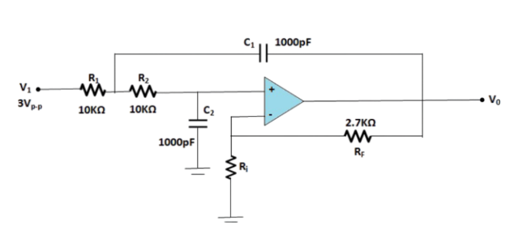

### Procedure
<figure style="text-align:center">

 <figcaption>[Main Circuit diagram of second order Active Low Pass Filter]</figcaption>
									</figure>    
<ol type="1">
  <li>Connect the circuit elements as mentioned below  1-2 ,3-4 ,5-6, 6-7, 8-9, 10-11, 10-12, 9-13, 14-17, 17-18, 3-15, 16-17.(ex:-Drag from 1 and click on 2.Connecting points are given in simulation tab)connection should be proper such that it implies the above circuit.</li> 
  
  <li> 3 volt p-p sinusoidal voltage is applied at the input. R1=10KΩ=R2, C1=C2=1000pF, RF=2.7KΩ. Put Ri= 4.7KΩ at first.
  
  <li> Obtain the cut off frequency Fo and the Q-factor for the component values shown in Fig.(Ri=4.7KΩ)by clicking the Calculate button &
  Verify that the circuit corresponds to a low pass Butter worth filter where the Q-factor =1/√2,Where the input voltage is 3V Sinusoidal.</li> 
  
<li>Switch on the oscilloscope by clicking "ON" button & click twice the Sine wave button to apply 3V sinusoidal voltage as input & click on the"Output" button to observe the output waveform with amplified output(Vo).Channel & Channel2 button shows the input & output signals respectively,Dual, shows both of them. </li>  

<li>Change the Frequency of input signal by the Frequency_Changer button for the values Fo/10, Fo/2, Fo, 2Fo,10Fo & observe the corresponding output voltage signal.</li> 

<li><b>Frequency_Changer :</b>Here the value of Fo=15.915KHz or 15915Hz(according to the Main circuit).By default the value of frquency will come 1591Hz or 1.591KHz i.eFo/10.
First double click this button exactly to change the frequency value Fo/2 i.e. 7957Hz,then single click to obtain Fo.Again click to have
2Fo=31830Hz & single click last time to have 10Fo=159150Hz.</li> 

<li>Click on 'TableShow' button to see observation table each time after observing the output value. for Ex: the first frequency is 1.591KHz ,click on 'Sine Wave'
button to see the input signal with frequency 1.591KHz,then click on 'Output' button to see the output voltage wave form and to have the magnitude value of Vo.
Now click on 'TableShow' button to take the first reading.After that change the frequency as said earlier and take the corresponding observations.
After taking 5 readings click on 'Plot' button to see the frequency response plot(Gain(dB)vs.Frequency(KHz)).</li> 
 
<li>Switch off the oscilloscope</li> 
<li>Click on Clear button to clear datas.</li> 
<li>Set the value of Ri=10KΩ,Click on Calculate button to see the change in Q value.Repeat the above steps.</li>
 
  </ol>	
  
