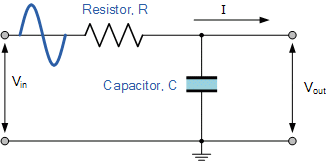
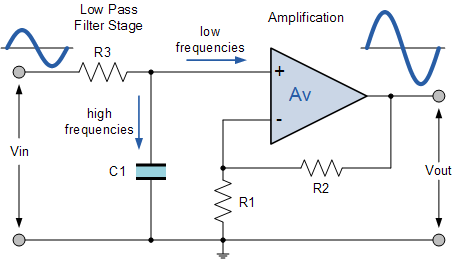
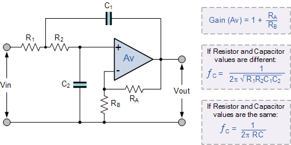
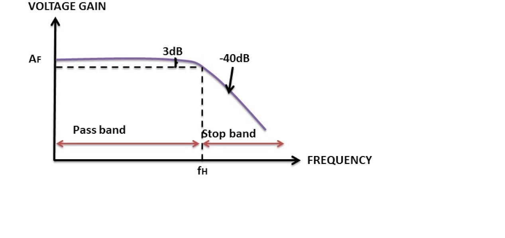

### Theory

A Low Pass Filter is a circuit that can be designed to modify, reshape or reject all unwanted high frequencies of an electrical signal and accept or pass only low frequency signals .Passive filters are made up of passive components such as resistors, capacitors and inductors and have no amplifying elements (transistors, op-amps, etc) so have no signal gain,therefore their output level is always less than the input.Here Fig 1 shows passive low pass filter circuit. 
Active Filters contain active components such as operational amplifiers, transistors or FET’s within their circuit design. They draw their power from an external power source and use it to boost or amplify the output signal.Active filters are generally much easier to design than passive filters, they produce good performance characteristics, very good accuracy with a steep roll-off and low noise when used with a good circuit design.
The number of storing element decides the order of the filter.Here Fig 2 shows a 1st order active low pass filter circuit.The four primary types of filters include the low-pass filter, the high-pass filter, the band-pass filter, and the notch filter (or the band-reject or band-stop filter). 

 <figcaption style="position:relative;top:40px;left:30px;font-size:12px;">
[Fig 1:Passive Low pass Single Stage Filter diagram]</figcaption>
 
 <figcaption style="position:relative;top:-150px;left:500px;font-size:12px;">[Fig 2:Active Low pass Single Stage Filter diagram]</figcaption> 
<b>Active second order Sallen Key Low pass filters(Butterworth): </b>which are also referred to as VCVS filters, because the op-amp is used as a Voltage Controlled Voltage Source amplifier, are another important type of active filter design because along with the active first order RC filters we looked at previously, 
higher order filter circuits can be designed using them.we can define second order filters as simply being: “two 1st-order filters cascaded together with amplification”.The Sallen-Key filter design is one of the most widely known and popular second order filter designs, requiring only a single operational amplifier for the gain control and four passive RC components to accomplish the tuning.Fig 3 shows a second order filter circuit with R1=R2=10KΩ, C1=C2=1000pF, Feedback Resistor RF=2.7KΩ,Ri=4.7KΩ(as used in our simulator circuit)  

 <figcaption style="position:relative;top:50px;left:50px;font-size:12px;">[Fig 3:Active Low pass second order Filter Circuit diagram]</figcaption> 

 <figcaption style="position:relative;top:-200px;left:530px;font-size:12px;">[Fig 4:Active second order Filter diagram ,Gain,Cutoff Frequency]</figcaption> 
A typical circuit diagram of a second order Sallen key low pass filter is shown in Figure3. With R1 = R2 = R and C1 = C2 = C ,the transfer function between the input and the output can be expressed as : 
$$\frac{Vo_(s)}{(V1_(s)}=\frac{K}{[1+(3-K)RCs+(RCs)^{2}]}$$
Where $$K =[1+\frac{RF}{Ri}]$$ 
The above expression clearly shown a low pass characteristics of the filter with
d.c gain = K, cut off frequency Fo=1/2πRC and the Q-factor, Q = 1/(3-K)
 
Generally, for second order butter worth filter the Q value is 0.707. and gain should be K~1.586.The frequency response of the Butterworth Filter approximation function is also often referred to as “maximally flat” (no ripples) response because the pass band is designed to have a frequency response which is as flat as mathematically possible from 0Hz (DC) until the cut-off frequency at -3dB with no ripples. Higher frequencies beyond the cut-off point rolls-off down to zero in the stop band at -40dB/decade .
This is because it has a “quality factor”, “Q” of just 0.707 The output voltage gain is given by:
$$| Vo(s)|= \frac{K * Vin}{\sqrt(1+f/fc)^{4}}$$							
 
   <figcaption style="text-align:center;position:relative;top:-60px;left:50px;font-size:12px;">[Fig 5: Frequency Response of second order Butterworth Filter]</figcaption>
                     
					
                     
